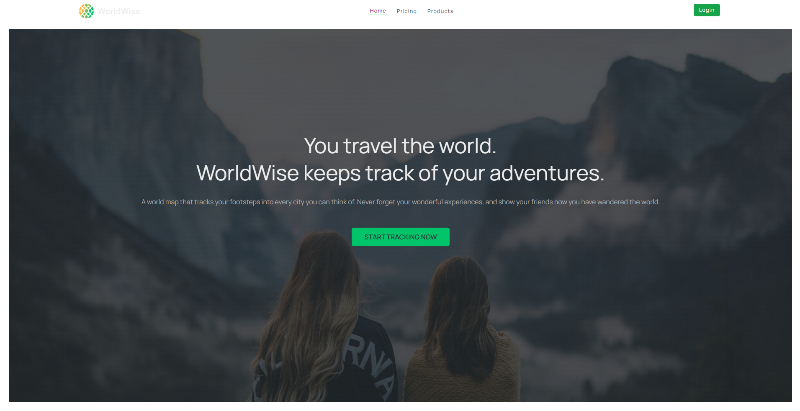
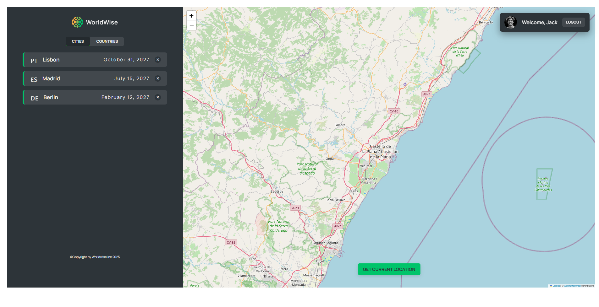
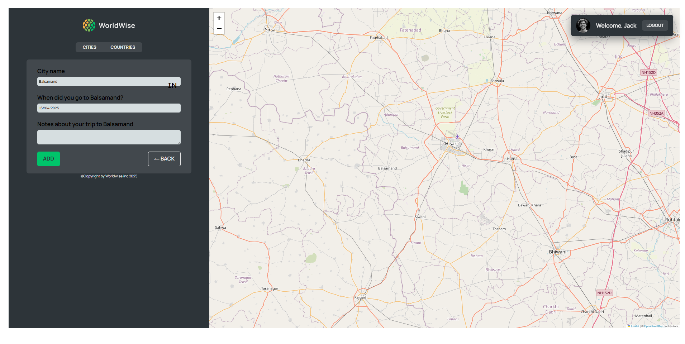
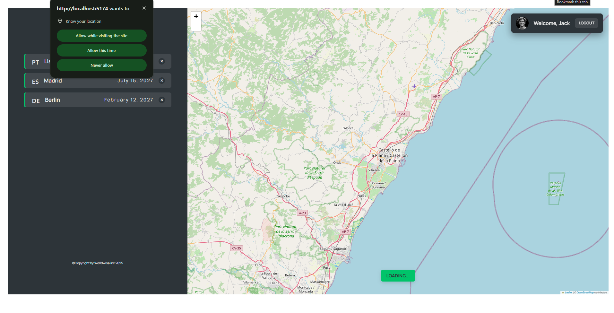

# 🌍 WorldWise

WorldWise is a sleek, responsive web application that helps users keep track of the cities they’ve visited across the globe. Built with modern React practices including Context API, CSS Modules, Tailwind CSS, and optimized with lazy loading and code splitting for performance.

## 🚀 Features

- 📍 Add and manage visited cities
- 🗺️ Interactive map integration
- 🔍 City detail view
- 🎨 Styled with Tailwind CSS + CSS Modules
- ⚡ Lazy loading and code splitting for better performance
- 🌐 Fully responsive design

## 🛠️ Tech Stack

- **React** (with Hooks & Context API)
- **Tailwind CSS**
- **CSS Modules**
- **React Router**
- **React Leaflet** (for map functionality)
- **React Lazy/Suspense** (for lazy loading components)
- **Vite** (builder)

## 📸 Screenshots

### 🧭 Home Page

### 🗺️ Map View

### ➕ Add City

### ➕ Location Feature

